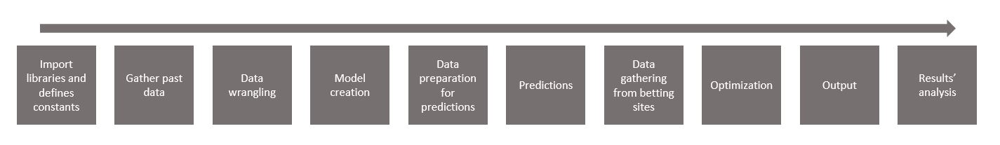

# Project idea
Project aimed to develop a ML model for choosing daily 7-man lineup for National Basketball Association games, with certain restrictions. 

With the rapid rise of Daily Fantasy sports betting options for different sports (basketball, football, mma) on different platforms (DraftKings,Fanduel), I thought it could be an interesting project to try and build a ML model that would analyze, predict and optimize a best-performing lineup on any given match-day.

The way Daily Fantasy betting works is by giving you a certain amount of virtual money (salary cap) that you can then use to pick and choose players for your daily lineup. Players of course come at a cost - better players with higher cost, worse players with lower cost.
Once you pick your lineup, you can enter competitions/tournaments against other bettors who picked their own lineup.

The idea of the project that if the betting sites do not set player-salaries at perfect efficiency, a well built model can provide some competitive adavantage over other players picking their team at random. 

# Project structure

## The project is built with several sections:

Libraries and packages
Importing all the libraries used in the project. Most important - pandas, numpy, scikit-learn, pulp, matplotlib, sqlite3, etc. 

Constants and basic data
Defining constants, such as the daily fantasy score (optimization goal of the project), basic boxscore items, such as points scored and rebounds, as well as advanced items, such as defensive efficiency and similar. Some helper-functionsfor the whole project are placed here as well.

1. Data gathering

1.1 Fetching past players' performance data for ML model development.
Creating a good ML model requires plenty of past data. For that purpose I utilize NBA_api package that allowed me to fetch ordinary and advanced boxscore data for all nba players/teams for the past seasons.

1.2 Fetching ongoing players' performance data for predicting.
Every day, as the matches are played, I utilize same NBA_api package to fetch recent performances, that will then be used for the prediction of performance for the next match.

2. Data wrangling.

Once the necessary data is fetched, before the ML modelling can take place, data has to be cleaned. Using Pandas and Numpy I clean the data and create rolling-averages of results for 1, 5 and 15 day windows. These attributes are stored with Sqlite3 and will then be used for learning and predicting.

3. Modelling.

Now that past-season data is ready, I utilize scikit-learn library to create a Random-Forest ML model (the model has ~88 attributes). The model is then stored using Pickle for later usage. 

4. Preparation for predictions.

As for modelling part, the new daily information on players' performance also has to be wrangled similarly, so that it can be plugged into the created model for predictions. 

5. Predictions.

Using model created in part 4 and data wrangled in part 5, I now make my predictions on how players will perform in their coming game.

6. Fetching salary data from betting sites.

This may have been the most difficult and tedious task. Using BeautifulSoup I created a script to scrape players' salaries and and relevant betting-information from betting site. To prevent any kind of misuse of the script for damaging the betting websites, I will not share here :)

7. Optimization.

Now I have my predictions how players will perform in their coming game and I now what salary they have on a betting website. For instance, player X might have a salary of 10M and I predict that he will score 50 daily fantasy points, while player Y has a a salary of 10M and will score 60 fantasy points. Now here it would be simple to just pick player Y, but it can gets extremely complex with 7-player lineup and varying salaries/predictions.
For that reason I utilize Pulp package for optimization. I do that by plugging in the data for predicted performance, salaries, salary cap and other restrctions, such as the total number of players, limit of players in certain basketball positions. 

8. Output.

I use smtplib package to receive the optimized lineup over email alongside data-quality information that I have been taking note of during the whole process (i.e. how much data fetched, how many attributes used in predictions)

9. Putting it all together.

Lastly, I run all the functions defined above get myself a daily basketball squad with ML-model predicted and then optimized performance :) 

10. Results' analysis.

Currently this is least developed part of my project. Now I utilize matplotlib library to visualize how my model's prediction compare against the actual results of the players every day, how a randomly picked team performed against my model-team.
 
## Files

1. main_file_v.10.0.ipynb

This is body of the whole project. Though placed in a single file, it is split into multiple sections and numerous functions, in a similart manner as my 11-bullet-point description above.

2. scikit_model_v.4.0.ipynb

This is where the ML model is created using past season's data from sqlite3 database. 

3. Send_email_v.4.0.ipynb

This is where the small script for information sending over email is placed.

4. results_analysis_v.4.1.ipynb

As mentioned above, developed part of the project. Currently produces daily comparison of model performance vs competition and randomly generated team

## Last remarks
The project is not plug-and-play for other users, as it needs tweaking for personal usage, especially salary data fetching from betting sites, that I am not willing to distribute. However, it can provide some insights and ideas how similar projects can be made! :) 

